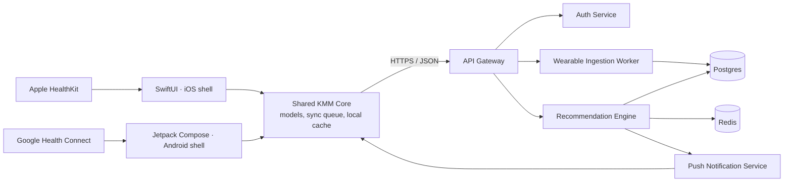
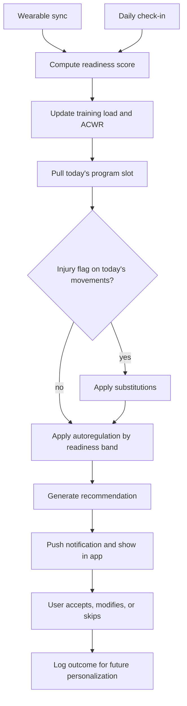

# Hybrid OS — Architecture Draft v0.1

*Product & systems architecture. Prepared for review, not implementation.*

**Lift · Run · Recover · Progress · Repeat**

## Decisions locked before this draft

| Decision | Choice | Why |
|---|---|---|
| Codebase strategy | Kotlin Multiplatform core, native UI | One coaching brain shared by both apps; SwiftUI and Compose stay fully native on top of it. |
| Engine location | Server-side | Coaching logic can be tuned and re-tuned without an App Store or Play Store release. |
| Engine approach | Deterministic rules, ML-ready | Every recommendation is explainable from day one; personalization layers on later, same interface. |
| MVP data sources | Apple HealthKit + Google Health Connect | Covers most wearables indirectly — no one-off SDK integration per device brand at launch. |

---

## 01 · Philosophy & Pillars

The five words aren't a slogan, they're a loop. Each pillar hands its output to the next, and the loop closes daily — that closure is the entire product.

- **Lift** — structured resistance training, progressed by load, volume, and RPE, not just logged after the fact.
- **Run** — cardio programmed against the user's goal and current training load, not a stopwatch with a history tab.
- **Recover** — sleep, HRV, resting heart rate, and how the user actually feels: first-class training inputs, not a wellness afterthought.
- **Progress** — the through-line. Every session should move a number the user cares about: load, pace, volume, or plain consistency.
- **Repeat** — today's outputs (what actually happened) become tomorrow's inputs. The loop is daily, not weekly.

The product's only real job is running that loop faster and more accurately than a human coach checking in once a week could.

---

## 02 · System Architecture

Wearable data enters through each platform's native health store. Everything downstream of that — the coaching brain — lives in one place, server-side, so it can change without shipping an app update.



### What each layer owns

| Layer | Owns |
|---|---|
| iOS / Android shells | Rendering, platform-native interactions, HealthKit / Health Connect permission prompts and reads. |
| Shared KMM core | Domain models, the HTTP client, the local offline cache, and the sync queue — written once, used by both shells. |
| API Gateway | Auth, request validation, routing. The only door into the backend. |
| Ingestion Worker | Normalizes incoming HealthKit / Health Connect payloads into the shared schema, deduplicates against prior syncs. |
| Recommendation Engine | Readiness scoring, training-load tracking, and the rules that turn a program plus today's data into today's session. See §07. |
| Postgres | System of record — users, programs, logged sessions, recovery metrics, recommendations. |
| Redis | Readiness-score cache, background job queue, rate limiting. |

---

## 03 · Tech Stack

Optimized for one small team building two native apps against one coaching brain — not for maximum resume coverage.

| Layer | Choice | Why |
|---|---|---|
| Shared core | Kotlin Multiplatform | One implementation of models, sync, and the API client — reused by both native shells. |
| iOS UI | Swift + SwiftUI | Native feel, direct HealthKit access. |
| Android UI | Kotlin + Jetpack Compose | Native feel, direct Health Connect access. |
| Local cache | SQLDelight | Type-safe SQL shared across KMM targets — offline workout logging without duplicated persistence code. |
| Networking | Ktor client | One HTTP layer for both platforms, inside the shared core. |
| Backend API | Python + FastAPI | Async, typed, and the natural home for the rules engine's future ML layer — same language, no rewrite. |
| Database | PostgreSQL | The data model is genuinely relational — programs, sessions, sets, and recovery metrics all reference each other. |
| Cache / queue | Redis | Readiness-score cache and the background job queue for nightly recomputation. |
| Background jobs | Celery (or equivalent) | Nightly readiness recompute, wearable sync, deload checks. |
| Auth | Sign in with Apple / Google via a managed auth provider | Satisfies store requirements with minimal custom auth code to maintain. |
| Push | APNs / FCM | Delivers the daily recommendation the moment it's ready. |
| Hosting | Managed Postgres + containerized services | Low ops overhead for a small team; scales up later without a re-architecture. |

---

## 04 · Core Experience

One screen carries the whole value proposition: open the app, see exactly what to do today, and see why. Everything else supports that screen.

**Primary flows**

- **Onboarding** — goal, experience level, equipment access, injury history, baseline lifts (measured or estimated), connect HealthKit / Health Connect.
- **Today (home)** — the day's single recommendation, with its reasoning, plus quick access to log it.
- **Log a lift session** — exercise list with prescribed sets/reps/load pre-filled, RPE or RIR capture per set, rest timer.
- **Log a run** — distance, pace, and heart-rate zones pulled from the health store where available, perceived effort otherwise.
- **Recovery check-in** — sleep, HRV, and resting HR shown automatically; a 10-second soreness and mood tap.
- **Progress** — strength trends, volume trends, PR log, body-weight trend, pace trends.
- **Program** — the active mesocycle, this week's plan, and where today sits inside it.
- **Settings** — equipment, injuries, connected data sources, units, notifications.

**The Today screen, in content-model terms:**

```
Today — Tuesday                          [ 74 · GO ]

LIFT — Upper Push
  Barbell Bench Press
  4 × 6 @ 82.5 kg
  "Readiness is high and you hit target RIR
   last session — load up 2.5kg."

Run — tomorrow           Easy 30 min · Zone 2
Recovery note             Sleep 6h 12m — a little short
```

A decision, a reasoning line, and one tap to act on it — that's the whole screen.

---

## 05 · Feature Roadmap

Ship the loop end-to-end before making it smarter. Adaptivity without a working loop is a demo, not a product.

### Phase 1 — MVP: the loop works

- Onboarding & profile
- Manual lift logging + exercise library
- HealthKit / Health Connect read: sleep, HRV, RHR, workouts
- Daily readiness score
- Daily lift recommendation with weight/rep progression
- Basic run logging
- Progress dashboard: volume, PRs, body weight
- Daily reminder + readiness push

### Phase 2 — Adaptive: the loop gets smarter

- Full periodization: mesocycles, auto deloads
- Autoregulated run prescriptions (easy / tempo / interval)
- Nutrition logging tied to training load and goal
- Direct wearable SDKs (Whoop, Garmin, Oura) if Health-store data proves insufficient
- Data export

### Phase 3 — Personalized: the loop learns the user

- ML layer on top of the rules engine — learns individual recovery response and progression rate
- Conversational coach ("why this?", "swap this exercise")
- Injury-aware programming from history, not just active tags
- Coach / community features

---

## 06 · Data Model

Relational where integrity matters (a set belongs to a session belongs to a user), `jsonb` where the shape genuinely varies (a recommendation's prescription differs for a lift day vs. a run day). Grouped by domain below — simplified DDL, not the full migration.

### Identity & profile

```sql
CREATE TABLE users (
  id UUID PRIMARY KEY DEFAULT gen_random_uuid(),
  email TEXT UNIQUE NOT NULL,
  auth_provider TEXT NOT NULL,        -- 'apple' | 'google'
  auth_provider_id TEXT NOT NULL,
  created_at TIMESTAMPTZ NOT NULL DEFAULT now()
);

CREATE TABLE user_profiles (
  user_id UUID PRIMARY KEY REFERENCES users(id),
  date_of_birth DATE,
  sex TEXT,
  height_cm NUMERIC(5,1),
  experience_level TEXT NOT NULL,     -- 'beginner' | 'intermediate' | 'advanced'
  primary_goal TEXT NOT NULL,         -- 'strength' | 'hypertrophy' | 'endurance' | 'general_fitness' | 'fat_loss'
  units TEXT NOT NULL DEFAULT 'metric',
  available_equipment JSONB NOT NULL DEFAULT '[]'
);

CREATE TABLE injuries (
  id UUID PRIMARY KEY DEFAULT gen_random_uuid(),
  user_id UUID NOT NULL REFERENCES users(id),
  body_region TEXT NOT NULL,          -- e.g. 'left_shoulder'
  description TEXT,
  active BOOLEAN NOT NULL DEFAULT true,
  started_at DATE,
  resolved_at DATE
);
```

### Exercise library & programming

```sql
CREATE TABLE exercises (
  id UUID PRIMARY KEY DEFAULT gen_random_uuid(),
  name TEXT NOT NULL,
  movement_pattern TEXT NOT NULL,     -- 'horizontal_push', 'hinge', 'squat', ...
  primary_muscle_group TEXT NOT NULL,
  secondary_muscle_groups TEXT[] NOT NULL DEFAULT '{}',
  equipment_required TEXT[] NOT NULL DEFAULT '{}',
  unilateral BOOLEAN NOT NULL DEFAULT false
);

CREATE TABLE exercise_substitutions (
  exercise_id UUID NOT NULL REFERENCES exercises(id),
  substitute_exercise_id UUID NOT NULL REFERENCES exercises(id),
  reason TEXT,                        -- 'shoulder_friendly', 'no_barbell', ...
  PRIMARY KEY (exercise_id, substitute_exercise_id)
);

CREATE TABLE programs (
  id UUID PRIMARY KEY DEFAULT gen_random_uuid(),
  user_id UUID NOT NULL REFERENCES users(id),
  name TEXT NOT NULL,
  status TEXT NOT NULL DEFAULT 'active',   -- 'active' | 'completed' | 'archived'
  started_at DATE NOT NULL
);

CREATE TABLE mesocycles (
  id UUID PRIMARY KEY DEFAULT gen_random_uuid(),
  program_id UUID NOT NULL REFERENCES programs(id),
  index INT NOT NULL,
  focus TEXT NOT NULL,
  weeks INT NOT NULL,
  deload_week_index INT
);

CREATE TABLE program_days (
  id UUID PRIMARY KEY DEFAULT gen_random_uuid(),
  mesocycle_id UUID NOT NULL REFERENCES mesocycles(id),
  day_index INT NOT NULL,
  day_type TEXT NOT NULL,             -- 'lift' | 'run' | 'recover' | 'rest'
  template JSONB NOT NULL             -- planned exercises/sets or run type, pre-adjustment
);
```

### Session logging

```sql
CREATE TABLE workout_sessions (
  id UUID PRIMARY KEY DEFAULT gen_random_uuid(),
  user_id UUID NOT NULL REFERENCES users(id),
  program_day_id UUID REFERENCES program_days(id),
  started_at TIMESTAMPTZ NOT NULL,
  ended_at TIMESTAMPTZ,
  notes TEXT
);

CREATE TABLE workout_sets (
  id UUID PRIMARY KEY DEFAULT gen_random_uuid(),
  workout_session_id UUID NOT NULL REFERENCES workout_sessions(id),
  exercise_id UUID NOT NULL REFERENCES exercises(id),
  set_index INT NOT NULL,
  prescribed_reps INT,
  prescribed_load_kg NUMERIC(6,2),
  actual_reps INT,
  actual_load_kg NUMERIC(6,2),
  rpe NUMERIC(3,1),
  rir NUMERIC(3,1)
);

CREATE TABLE cardio_sessions (
  id UUID PRIMARY KEY DEFAULT gen_random_uuid(),
  user_id UUID NOT NULL REFERENCES users(id),
  program_day_id UUID REFERENCES program_days(id),
  activity_type TEXT NOT NULL,        -- 'run' | 'bike' | 'row' | 'other'
  started_at TIMESTAMPTZ NOT NULL,
  duration_seconds INT NOT NULL,
  distance_meters NUMERIC(9,1),
  avg_hr INT,
  avg_pace_sec_per_km INT,
  perceived_effort NUMERIC(3,1),
  source TEXT NOT NULL DEFAULT 'app'  -- 'app' | 'healthkit' | 'health_connect'
);
```

### Recovery & biometrics

```sql
CREATE TABLE daily_recovery_metrics (
  id UUID PRIMARY KEY DEFAULT gen_random_uuid(),
  user_id UUID NOT NULL REFERENCES users(id),
  date DATE NOT NULL,
  hrv_ms NUMERIC(6,2),
  resting_hr_bpm INT,
  sleep_duration_min INT,
  sleep_quality_score NUMERIC(4,1),
  source TEXT NOT NULL,               -- 'healthkit' | 'health_connect' | 'manual'
  UNIQUE (user_id, date, source)
);

CREATE TABLE daily_checkins (
  id UUID PRIMARY KEY DEFAULT gen_random_uuid(),
  user_id UUID NOT NULL REFERENCES users(id),
  date DATE NOT NULL,
  soreness_1_5 SMALLINT,
  stress_mood_1_5 SMALLINT,
  UNIQUE (user_id, date)
);

CREATE TABLE body_metrics (
  id UUID PRIMARY KEY DEFAULT gen_random_uuid(),
  user_id UUID NOT NULL REFERENCES users(id),
  date DATE NOT NULL,
  weight_kg NUMERIC(5,2),
  body_fat_pct NUMERIC(4,1),
  source TEXT NOT NULL DEFAULT 'manual'
);
```

### Recommendation engine

```sql
CREATE TABLE readiness_scores (
  id UUID PRIMARY KEY DEFAULT gen_random_uuid(),
  user_id UUID NOT NULL REFERENCES users(id),
  date DATE NOT NULL,
  score NUMERIC(5,2) NOT NULL,
  band TEXT NOT NULL,                 -- 'red' | 'amber' | 'green'
  hrv_component NUMERIC(5,2),
  sleep_component NUMERIC(5,2),
  rhr_component NUMERIC(5,2),
  subjective_component NUMERIC(5,2),
  computed_at TIMESTAMPTZ NOT NULL DEFAULT now(),
  UNIQUE (user_id, date)
);

CREATE TABLE training_load (
  id UUID PRIMARY KEY DEFAULT gen_random_uuid(),
  user_id UUID NOT NULL REFERENCES users(id),
  date DATE NOT NULL,
  discipline TEXT NOT NULL,           -- 'lift' | 'run'
  acute_load NUMERIC(9,2) NOT NULL,
  chronic_load NUMERIC(9,2) NOT NULL,
  acwr NUMERIC(5,3) NOT NULL,
  UNIQUE (user_id, date, discipline)
);

CREATE TABLE recommendations (
  id UUID PRIMARY KEY DEFAULT gen_random_uuid(),
  user_id UUID NOT NULL REFERENCES users(id),
  date DATE NOT NULL,
  session_type TEXT NOT NULL,         -- 'lift' | 'run' | 'recover' | 'rest'
  prescription JSONB NOT NULL,
  reasoning JSONB NOT NULL,           -- ordered list of short factor strings
  readiness_score_id UUID REFERENCES readiness_scores(id),
  status TEXT NOT NULL DEFAULT 'pending', -- 'pending' | 'accepted' | 'modified' | 'skipped'
  user_modification JSONB,
  generated_at TIMESTAMPTZ NOT NULL DEFAULT now(),
  responded_at TIMESTAMPTZ,
  UNIQUE (user_id, date)
);
```

### Wearables & notifications

```sql
CREATE TABLE wearable_connections (
  id UUID PRIMARY KEY DEFAULT gen_random_uuid(),
  user_id UUID NOT NULL REFERENCES users(id),
  provider TEXT NOT NULL,             -- 'apple_health' | 'health_connect'
  last_synced_at TIMESTAMPTZ,
  permissions_granted JSONB NOT NULL DEFAULT '[]'
);

CREATE TABLE devices (
  id UUID PRIMARY KEY DEFAULT gen_random_uuid(),
  user_id UUID NOT NULL REFERENCES users(id),
  platform TEXT NOT NULL,             -- 'ios' | 'android'
  push_token TEXT NOT NULL,
  last_seen_at TIMESTAMPTZ NOT NULL DEFAULT now()
);
```

---

## 07 · Recommendation Engine

Deterministic and versioned, not a black box — every recommendation carries the reasoning that produced it. The same interface (inputs in, a prescription with reasoning out) will host learned weights in Phase 3 without the app changing at all.

### Readiness score

A 0–100 composite, recomputed nightly and on new wearable data:

| Component | Weight | Computed from |
|---|---|---|
| HRV delta | 40% | Z-score of today's HRV vs. rolling 7- and 28-day baseline, clipped to ±3. |
| Sleep | 25% | Duration vs. personal target, plus 3-night rolling sleep debt. |
| Resting HR delta | 15% | Inverse z-score vs. rolling baseline — elevated RHR lowers the score. |
| Subjective check-in | 20% | Soreness + stress/mood, 1–5 self-report. |

### Readiness bands

| Band | Range | Behavior |
|---|---|---|
| 🟢 GREEN | 70–100 | Full prescribed session. Autoregulation may allow a small overreach if progression criteria are met. |
| 🟡 AMBER | 40–69 | Proceed with the program, but volume and intensity are auto-reduced 10–20%. |
| 🔴 RED | 0–39 | Active recovery or full rest — the engine will not prescribe a hard session. |

*Band colors are functional, not decorative — they echo the same red/amber/green a lifter already reads on a plate rack, reused here as a status system instead of a load.*

### Training load & ACWR

Acute:chronic workload ratio, tracked per discipline, flags overreaching before the readiness score alone would catch it:

```
acute_load   = SUM(session_load, trailing 7 days)
chronic_load = AVG(weekly acute_load, trailing 28 days)
acwr = acute_load / chronic_load

acwr > 1.5  -> high injury-risk zone; engine caps volume growth this week
acwr < 0.8  -> detraining risk; engine nudges volume up if readiness allows
```

### Lift progression rule

```
for each exercise logged last session:
  if last_top_set.rir >= target_rir and last_top_set.reps_hit:
      next_load = last_load + smallest_equipment_increment   # +2.5-5%
  elif last_top_set.rir < target_rir - 1 or reps_missed:
      next_load = last_load                                  # hold, or -1 increment
  if held_or_reduced_for(exercise) >= 2 consecutive sessions:
      flag_movement_pattern_for_deload(exercise.movement_pattern)
```

### Run recommendation rule

```
planned = active_run_plan.slot_for(today)          # easy / tempo / interval / long

if readiness.band == 'green':
    prescription = planned
elif readiness.band == 'amber':
    prescription = downgrade(planned, to='easy')     # hard days swap to easy/moderate
else:  # red
    prescription = rest_or_zone1_recovery_jog(cap_minutes=25)

weekly_mileage_increase = min(planned_increase, 10%)  # capped regardless of band
if run_acwr > 1.4 or injury_flag_active:
    weekly_mileage_increase = 0
```

### Deload trigger

Fires at the macro level, independent of any single day's readiness: accumulated volume trending up for 4–6 weeks, rolling 7-day readiness declining for two consecutive weeks, and sustained ACWR > 1.3 together insert an automatic deload week — volume down ~40%, intensity held, session count reduced.

### Injury-aware substitution

An active injury tag (e.g. `left_shoulder`) filters today's prescribed exercises against `exercise_substitutions` and swaps any conflicting movement for one hitting the same muscle group and pattern, before autoregulation is applied.

### Daily pipeline



### Recommendation output

```json
{
  "date": "2026-07-28",
  "session_type": "lift",
  "prescription": {
    "exercises": [
      { "name": "Barbell Bench Press", "sets": 4, "reps": 6, "load_kg": 82.5 }
    ]
  },
  "reasoning": [
    "Readiness 74 (green) — full session cleared",
    "Last session: RIR 2 at target, reps hit — progressing load +2.5kg"
  ],
  "readiness_score": 74,
  "band": "green",
  "editable": true
}
```

Accept / modify / skip is captured on every recommendation. That signal is the entire Phase 3 training set — no separate data-collection effort needed, it's a byproduct of the loop running.

---

## 08 · Sync, Offline & Data Integrity

A lift session gets logged in a gym basement with no signal more often than not — offline can't be an edge case.

- **Local-first logging.** The KMM core writes every set to the local SQLDelight cache immediately and queues it for sync; the UI never waits on the network to record a rep.
- **Append-only sets.** `workout_sets` rows are created, not edited, once synced — this makes conflict resolution close to a non-issue for the highest-frequency write path.
- **Last-write-wins with timestamps** for the low-frequency fields that can conflict — profile edits, injury flags — compared by `updated_at`.
- **Wearable sync cadence.** Foreground sync on app open, background sync via each platform's health-store observer API, plus a nightly server-side batch that recomputes readiness and the next day's recommendation ahead of the morning push.

---

## 09 · Privacy & Non-Functional Requirements

- **Sensitive by default.** HRV, sleep, and body metrics are treated as sensitive health data regardless of regulatory category — encrypted at rest, never sold, and the user can export or delete everything from Settings.
- **Minimal retention.** Raw wearable payloads are discarded after normalization into the shared schema; only the derived metrics persist.
- **Stateless engine.** The recommendation engine reads and writes but holds no session state, so it scales horizontally without coordination.
- **Notification discipline.** One recommendation push per day, one readiness alert only when the band actually changes — never a re-engagement ping disguised as a coaching signal.

---

## 10 · Build Sequence

Order matters here — each step needs real data from the one before it, so building out of sequence means faking data to test the next piece.

1. **Schema & exercise library** — finalize the §06 tables, seed a real exercise library with movement patterns and substitution map.
2. **Auth & onboarding** — sign in, profile, goal, equipment, injury history.
3. **Manual logging** — lift and run logging flows; the app has to be useful with zero wearable data first.
4. **HealthKit / Health Connect read** — sleep, HRV, RHR, workouts flowing into `daily_recovery_metrics`.
5. **Readiness score v1** — the formula in §07, computed nightly.
6. **Recommendation engine v1** — rules only: lift progression and recovery-day logic first, run logic follows.
7. **Today screen & push** — the one screen the whole product hinges on.
8. **Progress & analytics** — volume, PRs, trends: the payoff view.
9. **Deload & ACWR logic** — needs several weeks of real training-load data to be meaningful; build after the above is live in a private beta.
10. **Private beta** — small cohort, real training, watching accept/modify/skip rates on recommendations before Phase 2.
